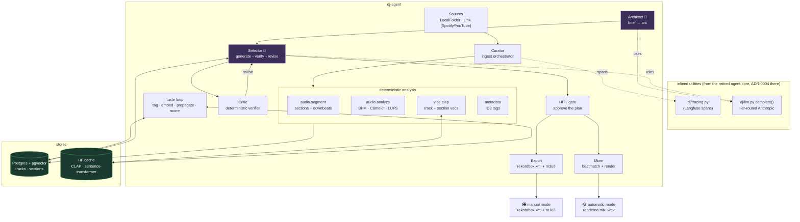
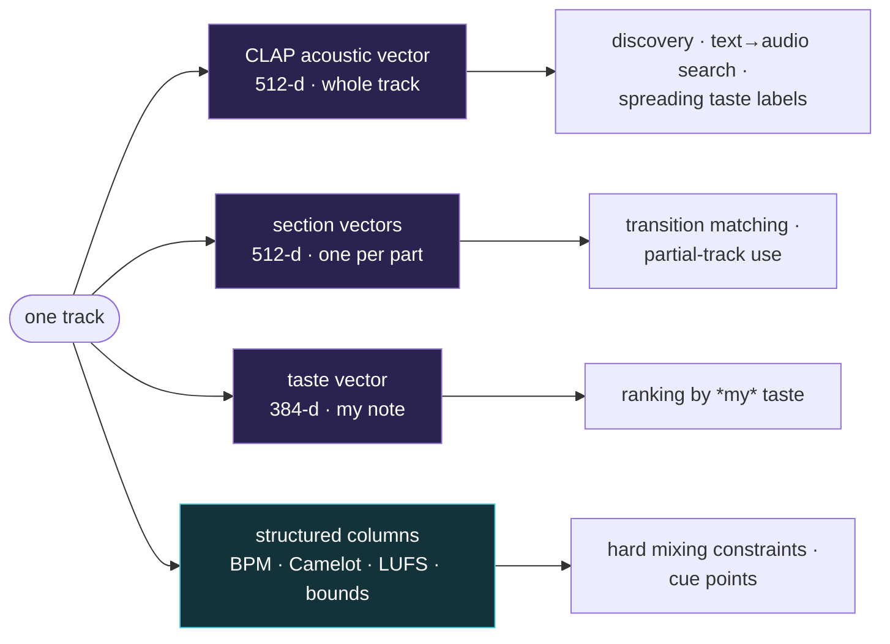
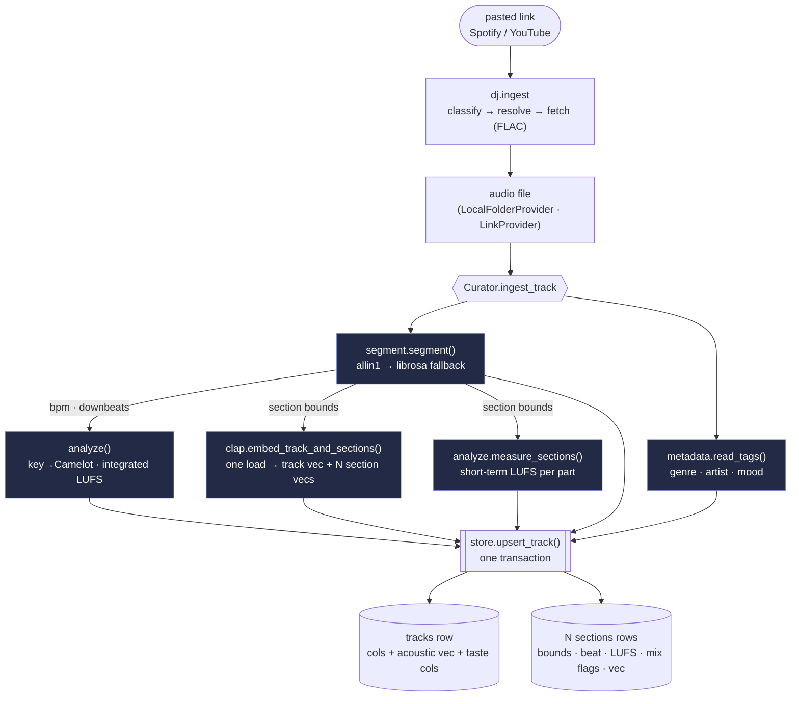
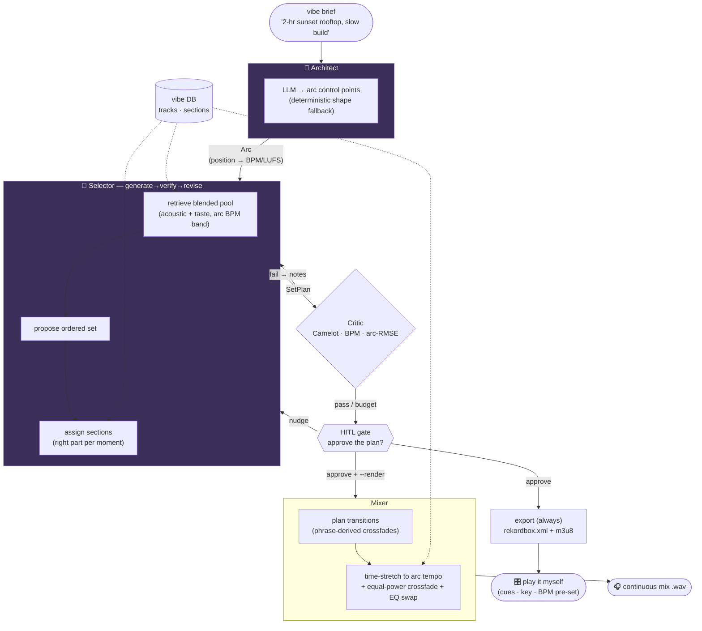
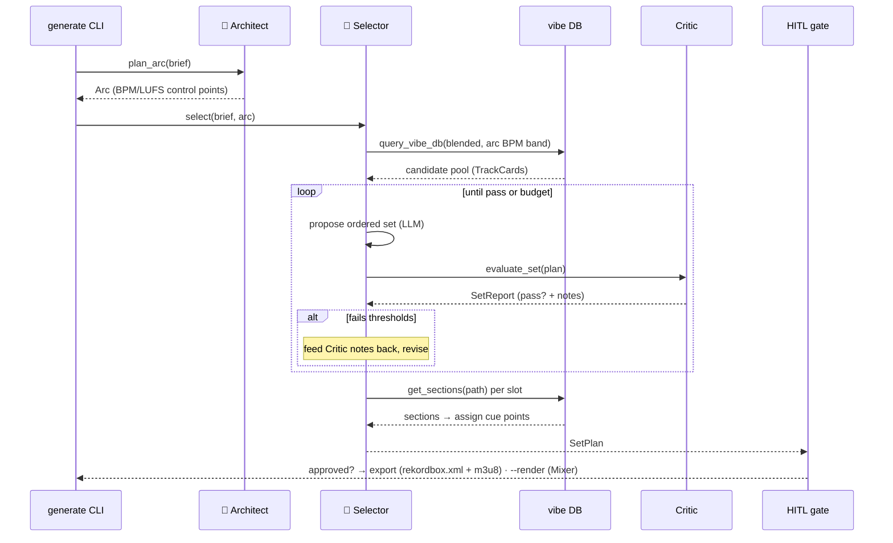

# Architecture

## The pitch

Spotify DJ is a recommender in a costume — it legally can't touch audio (no
beatmatch, no arc) and it optimizes for *everyone*, not me. **dj-agent** analyzes
my own library into a vibe vector DB, **learns my taste** from how I tag and
react to tracks, **segments every song** so it can mix in and out of the right
*part*, and renders real continuous sets with a planned energy arc.

It's a **personal** agent — for me and my friends, not a product. Licensing is a
non-issue (personal use), so we ingest my real library and make my taste the
center of gravity.

---

## The system at a glance

Two layers: the **dj-agent** components and the **stores** (Postgres/pgvector +
the HF model cache), on two thin inlined utilities — `dj/llm.py` (tier-routed
Anthropic `complete()`) and `dj/tracing.py` (Langfuse spans, no-op without
keys) — kept from the retired agent-core substrate. Everything except the
Architect and Selector is deterministic Python — no LLM.

🤖 = LLM agent (`dj.llm.complete()`, Anthropic). Everything else is
deterministic.

---

## Representations per track

"Fits the vibe," "is *my* kind of track," and "will actually mix" are different
questions, so each gets its own representation:

| Representation | Holds | Used for |
|---|---|---|
| **CLAP acoustic vector** (512-d, track) | generic "what it sounds like" | discovery; text→audio search; spreading taste labels |
| **Taste vector** (384-d, track) | *mine* — my note embedded | ranking by my taste (`ADR 0003`) |
| **Section vectors** (512-d, per section) | the vibe of *each part* | transition matching; partial-track use (`ADR 0004`) |
| **Structured columns** | hard math — BPM, Camelot, LUFS, section bounds/beats | mixing constraints + cue points (`ADR 0005`) |

Semantics live in vectors, mixing math in columns — never mixed. Acoustic and
taste are **separate vectors on the same row** so queries can blend them or use
either alone, with no second database to sync.

---

## Ingestion data flow (the Curator)

The Curator is the background, all-day builder. Per track it fans out into four
deterministic analyzers, then writes **one `tracks` row + N `sections` rows** in a
single idempotent transaction. The section detector runs *once* and feeds both the
beat grid (for BPM/downbeats) and the section bounds (for per-section vectors).

Idempotent: re-ingesting a file upserts its `tracks` row `ON CONFLICT (path)` and
**replaces** its sections, so the Curator is safe to re-run (`ADR 0004`). Detector
provenance (`allin1` vs `librosa`) is attached to the trace span for debugging.

Two front doors feed this same pipeline (`ADR 0009`): `LocalFolderProvider`
walks files I already own; `LinkProvider` (`dj.ingest`) turns a pasted
Spotify/YouTube link into files first — classify the URL, resolve it to a
tracklist (metadata only, nothing downloaded yet), fetch each track as FLAC via
`yt-dlp`, then yield the files into the Curator. Downloads are idempotent by
video id, and a single dead video skips with a `FAILED` line instead of killing
the playlist. `python -m dj.ingest <url> [--favorites]`, or hand the URL
straight to `python -m dj.curator` — it accepts a link anywhere it took a
folder. See **Sources & sharing** below for the matching/ISRC details.

---

## Set generation (Phase 3 → 4)

A vibe brief becomes an approved, playable set. The **Architect** shapes the
journey (an arc artifact), the **Selector** orders tracks *and sections* to it in
a verify loop against the deterministic **Critic**, the **HITL gate** approves the
plan as data, and only then is anything materialized: the manual-mode export
always (rekordbox.xml + m3u8, `ADR 0010`), the **Mixer**'s automatic render on
`--render`.

### The Selector's loop, step by step

With **no API key**, the Architect falls back to a deterministic arc shape and the
Selector to a greedy nearest-fit ordering — so a usable set still comes out, and
that greedy set is also the eval A/B baseline (`ADR 0006`).

---

## Three-layer model (responsibilities)

| Component | Module | Phase | Type | Key dep |
|---|---|---|---|---|
| Sources | `dj.sources.*` | 1 | Seam / I/O | pathlib |
| Link ingestion | `dj.ingest.*` | 5+ | I/O + seams | spotipy + yt-dlp (+ ffmpeg) |
| Segmentation | `dj.audio.segment` | 1 | DSP / ML | allin1 → librosa fallback |
| Analysis | `dj.audio.analyze` | 1 | Deterministic DSP | librosa + pyloudnorm |
| Camelot | `dj.audio.camelot` | 0 | Pure logic | — |
| CLAP encoder | `dj.vibe.clap` | 1 | ML inference (local) | torch + transformers |
| Metadata | `dj.metadata` | 1 | I/O | mutagen |
| Vibe store | `dj.vibe.store` | 1 | I/O + search | psycopg2 + pgvector |
| Curator | `dj.curator` | 1 | Orchestrator | all of the above + tracing |
| Taste loop | `dj.taste.*` | 2 | ML + logic | sentence-transformers |
| Arc artifact | `dj.arc` | 3 | Pure logic | — |
| Plan types | `dj.plan` | 3 | Pure data | — |
| Architect | `dj.agents.architect` | 3 | LLM agent | `dj.llm` `complete()` |
| Selector | `dj.agents.selector` | 3 | LLM agent + verify loop | `dj.llm` + Critic |
| Tool layer | `dj.agents.tools` | 3 | Seam | store + camelot + critic |
| Critic | `dj.critic` | 3/5 | Deterministic verifier | numpy + camelot |
| HITL gate | `dj.agents.hitl` | 3 | I/O + formatter | — |
| Mixer | `dj.mixer` | 4 | Deterministic DSP | librosa + pyrubberband + soundfile |
| Eval scorecard | `dj.evals.runner` | 5 | Deterministic + DB | numpy + Critic |
| Plan persistence | `dj.persist` | 5 | I/O (JSON) | — |
| Explain | `dj.agents.explain` | 5 | Pure formatter | — |
| Set export | `dj.export.rekordbox` | 5+ | Pure file building | stdlib ElementTree |
| Memory | `dj.memory` | 6 | ML (backlog D1) | — |

**agent-core was retired** (its ADR-0004): dj was its only real consumer, so
the two functions dj used were inlined — `dj.tracing.trace` (Curator spans)
and `dj.llm.complete` (Architect/Selector LLM calls). There is no external
substrate dependency.

---

## HITL gate

One high-value human-in-the-loop checkpoint: **approve the set before
rendering** — *per set, not per track*. The Selector proposes a plan as **data**
(`dj.plan.SetPlan`): ordered tracks, the *sections* it'll use, cue points,
target-vs-actual arc, and flagged rough transitions (rendered by
`dj.agents.hitl.render_plan`). I read it and approve or nudge before the Mixer
spends compute. This *is* the **set-acceptance** eval metric. Controlled by
`HITL_LEVEL`: `full` (always pause) | `none` (skip, for eval runs).

---

## Sources & sharing

Personal use → ingest my real library, no licensing hedging. The differentiators
vs Spotify are **audio manipulation** (real beatmatched, section-aware
transitions, which need the raw decodable file) and the **personal taste model**.
Streaming APIs still can't provide raw audio, so they're excluded as an *audio*
source by design — but a streaming link is now a perfectly good way to *name*
the music I want.

**Two front doors into the same Curator pipeline:**

- **`LocalFolderProvider`** — files I already own; the original path.
- **`LinkProvider`** (`dj.ingest`, `ADR 0009`) — paste a Spotify or YouTube
  track/album/playlist link and it becomes local files. `links.classify` types
  the URL (open.spotify.com incl. `/intl-xx/` and `?si=`, `spotify:` URIs,
  watch/youtu.be/shorts/playlist, music.youtube.com; scheme-less pastes work);
  `resolve` expands it to a tracklist — Spotify catalog metadata via
  client-credentials `spotipy` (artist/title/album/duration/**ISRC**; no user
  auth, no browser), YouTube via `yt-dlp -J` with a heuristic
  artist/title split from the video name — nothing downloaded yet; `fetch`
  pulls each track as FLAC. Spotify entries have no audio source, so each is
  matched against a YouTube search scored mostly on **duration closeness** (the
  wrong cut — live, sped-up, extended — poisons BPM, sections, and the vibe
  vector alike), and the downloaded file is **stamped with the catalog's
  artist/title/album/ISRC** so identity survives the detour — that ISRC is what
  lets a parked taste review auto-apply confidently at ingest (`ADR 0008`).
  Honest limits: artist/title from YouTube titles is heuristic; YouTube-only
  tracks carry no ISRC (parked reviews then match by name+duration); and the
  audio ceiling is YouTube's (~128–160 kbps opus in a FLAC container) — fine
  for listening and analysis, buy the file for anything precious.

**And one back door out** (`dj.export`, `ADR 0010`): every approved set ships in
**two playable forms**. *Manual* — a `rekordbox.xml` + `.m3u8` written to
`DJ_OUTPUT_DIR` on every approval: import into rekordbox and perform the set
myself, with order, BPM, key, and the planned MIX IN/OUT cue points already on
every track. *Automatic* — `--render`: the Phase 4 Mixer's continuous
beatmatched file; press play. Sharing the *selection* (not the mix) with friends
as a **Spotify playlist** via the Spotify MCP stays on the backlog (B1).

---

## Key design decisions

See `docs/adr/` for full records:

- **pgvector over a dedicated vector DB** — vector + taste + metadata + sections
  in Postgres; one query, no sync. `adr/0001`.
- **CLAP from the start** — learned audio+text embeddings; text→audio on day one.
  `adr/0002`.
- **Personal taste layer** — notes + light tags → a taste vector blended with
  CLAP; tag ~150 and propagate. The thing that makes it *mine*. `adr/0003`.
- **Structure-aware sections** — sections are first-class rows with their own
  vectors, so a set can use *part* of a track and mix on musical boundaries.
  `adr/0004`.
- **Calibrated beats + energy** — downbeat-derived BPM and cross-track LUFS, so
  beatmatching and the energy arc actually work. `adr/0005`.
- **One planning agent + a deterministic verifier** — the Architect emits an arc
  artifact and the Selector runs generate→verify→revise against the Critic; both
  fall back to deterministic baselines so the system runs offline. `adr/0006`.
- **Phrase-derived crossfades** — overlap length comes from the section's bar
  grid, not a fixed wall-clock time, so a blend stays inside one phrase. `adr/0007`.
- **Capture taste before you own the file** — a review left while listening
  (Spotify now-playing or in chat) parks in `pending_taste`, and the Curator drains
  it into the track's taste on the matching ingest (confident matches only). `adr/0008`.
- **Links are a front door, not a streaming integration** — a pasted
  Spotify/YouTube link resolves to a tracklist (Spotify = metadata + ISRC,
  YouTube = the audio via yt-dlp), downloads as FLAC, and flows through the same
  Curator pipeline. spotdl was rejected: owning the duration-dominant match and
  the official metadata (ISRC) matters for the taste loop. `adr/0009`.
- **Two playable forms of every approved set** — manual (rekordbox.xml + m3u8:
  I perform the transitions; order/key/BPM/cues pre-set) and automatic (the
  rendered mix: press play). `adr/0010`.
- **Deterministic everything except Architect/Selector** — analysis and
  propagation have no ambiguity; the agents earn their cost on fuzzy vibe-fit and
  arc planning.
- **No substrate dependency** — the retired agent-core's two useful functions
  live inlined in `dj/llm.py` + `dj/tracing.py`.

See `docs/set-generation.md` for the Phase 3/4 deep-dive (arc, Selector loop,
Critic metrics, Mixer transitions) and `docs/taste.md` for the personal layer.
