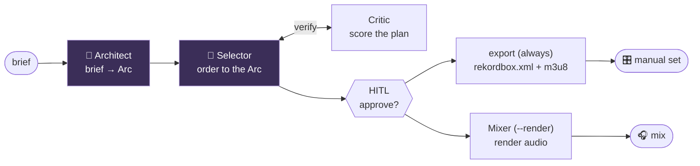
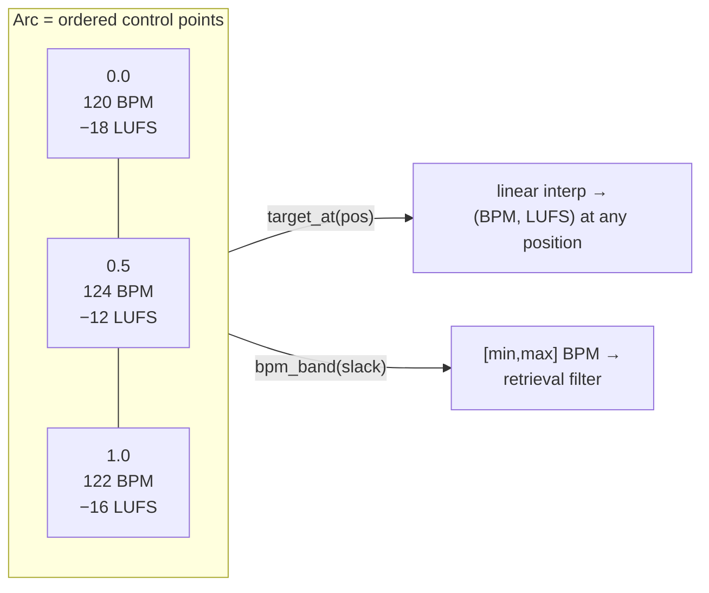
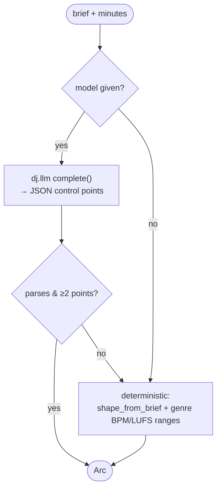
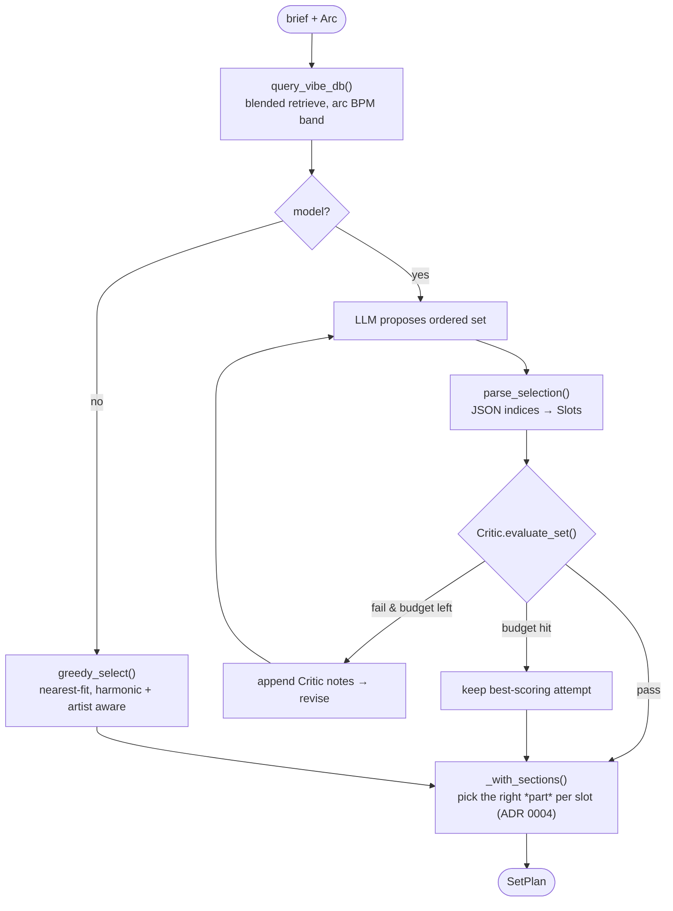
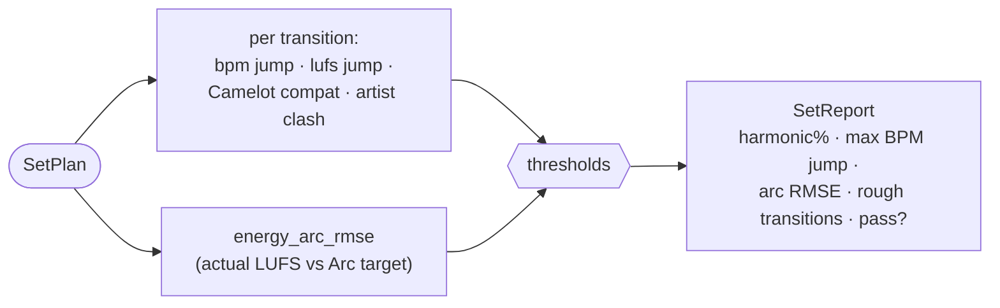
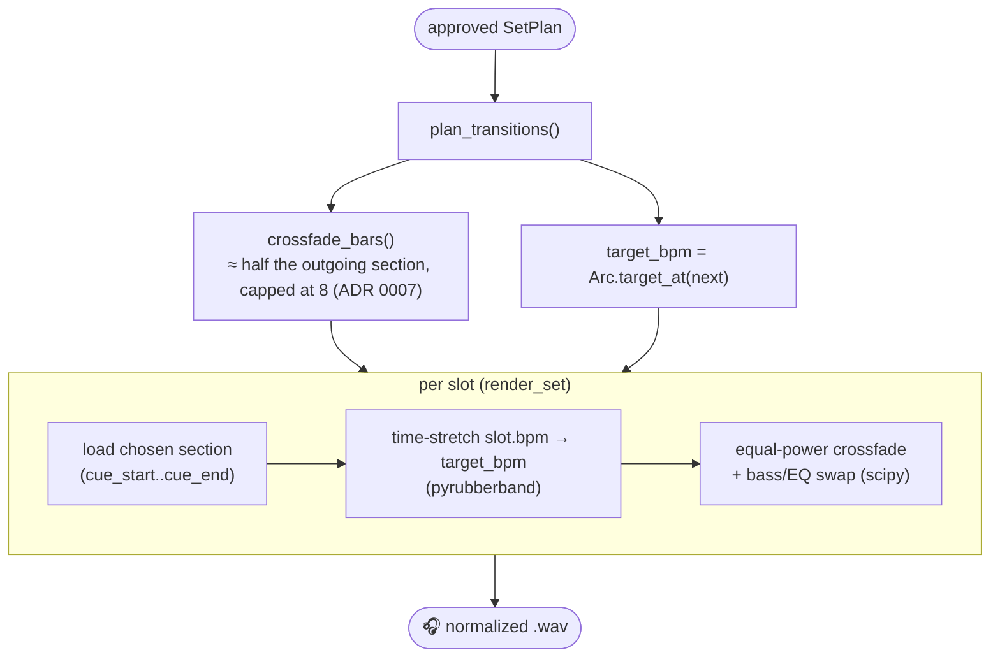

# Set generation — Architect, Selector, Critic, Mixer (Phase 3 → 4)

> The deep-dive on how a vibe brief becomes a playable set — manual (rekordbox)
> or automatic (a rendered, beatmatched mix). Decisions in `adr/0006` (agent
> shape), `adr/0007` (crossfades), and `adr/0010` (two playable forms). Built +
> unit-tested without a DB, model, or audio (the heavy edges are injectable seams).

The pipeline is four stages, only two of which are LLM agents:



---

## 1. The Arc (`dj/arc.py`) — the set's shape as data

The arc is the **contract** between the agents and the deterministic layers. It's
just control points the rest of the system interpolates, so the LLM only emits a
handful of numbers and every consumer (`Selector`, `Critic`, `Mixer`, `HITL`) is
pure and testable.



Energy is in **LUFS** (cross-track comparable, `ADR 0005`), so "warm-up at −18,
peak at −9" is a real, schedulable target — exactly what the **Energy-arc RMSE**
eval measures. Named shapes (`build` · `peak` · `wave` · `down` · `flat`) give the
deterministic fallback its curve; `shape_from_brief()` picks one from keywords.

---

## 2. The Architect (`dj/agents/architect.py`) — brief → arc

A small, high-value LLM step: translate a free-text brief into 4–7 arc control
points as JSON. The model is an **injectable callable** (`messages → str`) so it's
testable with a fake and runs offline:



Any LLM or parse failure silently degrades to the deterministic arc — the system
never hard-fails on the model.

---

## 3. The Selector (`dj/agents/selector.py`) — generate → verify → revise

The agentic core. It retrieves a **blended** candidate pool (the same brief drives
both the CLAP acoustic query *and* the taste-note query), proposes an ordered set,
and revises against the Critic until the plan passes or it runs out of budget.



**Section assignment** is the ADR 0004 payoff: for each chosen track, `pick_section`
grabs the section whose LUFS is closest to the arc's target *at that moment* — a
peak slot takes the drop, a warm-up slot takes the intro — and writes its
downbeat-anchored cue points onto the slot.

The greedy fallback's cost function makes the trade-offs explicit:

```
cost(card) = 1.0·|bpm − target_bpm|        # tempo fit
           + 1.5·|lufs − target_lufs|       # energy fit
           − 8.0·taste_score                # reward my taste
           + 25.0 if key-incompatible       # keep transitions harmonic
           + 15.0 if same artist as prev     # space artists
```

---

## 4. The Critic (`dj/critic.py`) — the deterministic verifier

No LLM, no audio (yet) — pure math over the structured columns. It's both the
Selector's verifier *and* the eval scorecard core (Phase 5). Camelot compatibility
is a **hard** constraint; BPM/energy jumps and arc fit are **soft** (penalized and
surfaced, not forbidden).



| Metric | Meaning | Default gate |
|---|---|---|
| harmonic-compat % | fraction of transitions Camelot-OK | ≥ 70% |
| max BPM jump | largest adjacent tempo jump | ≤ 6 BPM |
| energy-arc RMSE | set LUFS curve vs target arc | ≤ 4 LUFS |
| artist repeats | back-to-back same artist | 0 |

The audio-level **transition smoothness** (spectral discontinuity at the *actual*
mix point) is a Phase 5 add-on once the Mixer renders; the Critic here scores the
*plan*.

---

## 5. The Mixer (`dj/mixer.py`) — phrase-aligned, beatmatched render

Because the Selector chose *sections* with downbeat-anchored cue points, "mix out
of A's outro into B's chorus" is literal. Per transition:



The crossfade length is **derived from the phrase grid**, not a fixed time — a
fixed 8-bar fade swallows a 4-bar outro and underuses a 32-bar one (`ADR 0007`).
Rendering degrades gracefully: no `pyrubberband` → play at native tempo; no
`scipy` → equal-power crossfade without the EQ swap. The output is normalized to a
robust peak (the 99.9th-percentile sample, so one transient can't crush the set's
level and flatten the arc).

> **Honest caveat (backlog A1).** What ships today is a **tempo-glide, equal-power,
> phrase-length crossfade** — *not yet* a sample-accurate beat-lock. Two gaps,
> verified by the review, remain and need tuning on **real audio** (which is why
> they're parked for a session at the decks, not auto-applied):
> 1. the crossfade overlaps A's section tail with B's section head but does **not**
>    phase-align downbeats at the splice (B's bar 1 lands at A's current phase), and
> 2. each track is stretched to its **own** arc-position tempo, so on a non-flat arc
>    the two tracks sit at slightly different tempos through the overlap (≤ ~1.5 BPM).
>
> Both are real, audible, and on the roadmap — see `docs/backlog.md` A1. The
> section *cue points* are genuinely downbeat-anchored at ingest; the missing piece
> is threading those downbeat **times** into the render and matching seam tempo.

---

## 6. Two playable forms of an approved set (`dj/export/rekordbox.py`, ADR 0010)

Approval at the HITL gate now produces **two ways to play the same plan** — the
agent's homework (ordering, key compatibility, energy arc, cue points) is
identical in both; what differs is who performs the transitions:

- **Manual mode (always written).** On every approved set, `generate` exports a
  `rekordbox.xml` + `.m3u8` to `DJ_OUTPUT_DIR` (`--rekordbox <path>` overrides
  the XML location). Import via rekordbox **Preferences → Advanced → Database →
  rekordbox xml**, drag the playlist in, and play the set myself: the COLLECTION
  carries each track's BPM, key (`camelot.key_name`: `8A` → `Am`), and the
  Selector's chosen section bounds as **MIX IN / MIX OUT** markers — each written
  twice, as a hot cue (Num 0/1) and as a memory cue, so they survive players with
  hot cues off. `store.track_durations()` feeds `TotalTime`, which rekordbox
  scales cue positions against, so pass-through of real file durations places
  the markers exactly. The playlist node (`dj-agent — <arc name>`) lists the
  slots in set order (repeats allowed); the collection dedupes by path, first
  slot wins the cues. The m3u8 is the lowest-common-denominator fallback —
  order only, no cues. Pure stdlib (`ElementTree`): no DB, audio, or network in
  the export itself.
- **Automatic mode (`--render`).** The Phase 4 Mixer's continuous beatmatched
  file. Press play — with the §5 caveat that seams aren't yet phase-locked.

> **Beat grid (ADR 0011, was backlog E2).** When the library knows a track's
> first downbeat (`tracks.first_downbeat_s`, stored at ingest), the XML carries
> a real `TEMPO Inizio` — the imported grid is *ours*, bar-1s where the detector
> put them. Tracks ingested before the anchor column (or via the single-section
> fallback) still omit TEMPO so rekordbox analyzes those itself; cue marks are
> wall-clock seconds and land correctly either way. Still to verify on a real
> import: that a supplied anchor wins over rekordbox's re-analysis.

---

## 7. Eval scorecard + `--explain` (Phase 5)

Two deterministic surfaces close the loop on *quality*:

- **`dj/evals/runner.py`** — the scorecard. It reuses the Critic for the
  transition metrics (BPM continuity, harmonic-compat %, energy-arc RMSE, artist
  spacing) and adds the two **personal** metrics the Critic can't see:
  **taste-match** (mean cosine of the set's taste vectors to the centroid of my
  hand-labeled favorites) and **discovery ratio** (fraction of the set I hadn't
  already labeled/favorited). `compare_to_acoustic_baseline()` builds the set with
  the full blend vs a CLAP-only (taste-off) blend so you can see the blended set
  win on taste-match — the Phase 3 verify goal, runnable offline.
- **`dj/agents/explain.py`** — `--explain` narrates the plan deterministically:
  the opening/peak/closing BPM+LUFS, harmonic flow (incl. energy-boost lifts and
  key-run length), and the section picks ("rides the drop of X at the apex"). No
  model required; the facts come from the plan.

Every generated set is also logged by `dj/persist.py` to
`renders/set_history.jsonl` (brief + approval verdict + the full plan) — the raw
data behind the **set-acceptance** metric and the recently-played dedup.

## Running it

```bash
# offline (deterministic arc + greedy selector, no API key), with narration:
uv run python -m dj.agents.generate "2-hr sunset rooftop, slow build" --offline --explain

# live (LLM Architect + Selector), then ALSO render the automatic mix:
uv run python -m dj.agents.generate "peak-time techno" --minutes 60 --render

# eval A/B: does the blended Selector beat a CLAP-only baseline on taste-match?
uv run python -m dj.evals.runner "2-hr sunset rooftop, slow build"
```

Track count is derived from `--minutes` (~3.5 min/track) unless `--tracks` is
given. Every approved set writes the manual-mode `rekordbox.xml` + `.m3u8` to
`DJ_OUTPUT_DIR` with no flag needed (§6; `--rekordbox <path>` moves the XML);
`--render` adds the automatic mix and needs the `mixer` extra (`uv sync --extra
mixer` + the `rubberband` CLI). All three need an ingested library (`python -m
dj.curator <folder-or-url>`). Recently-played tracks are skipped across runs
unless `--allow-repeats`.
