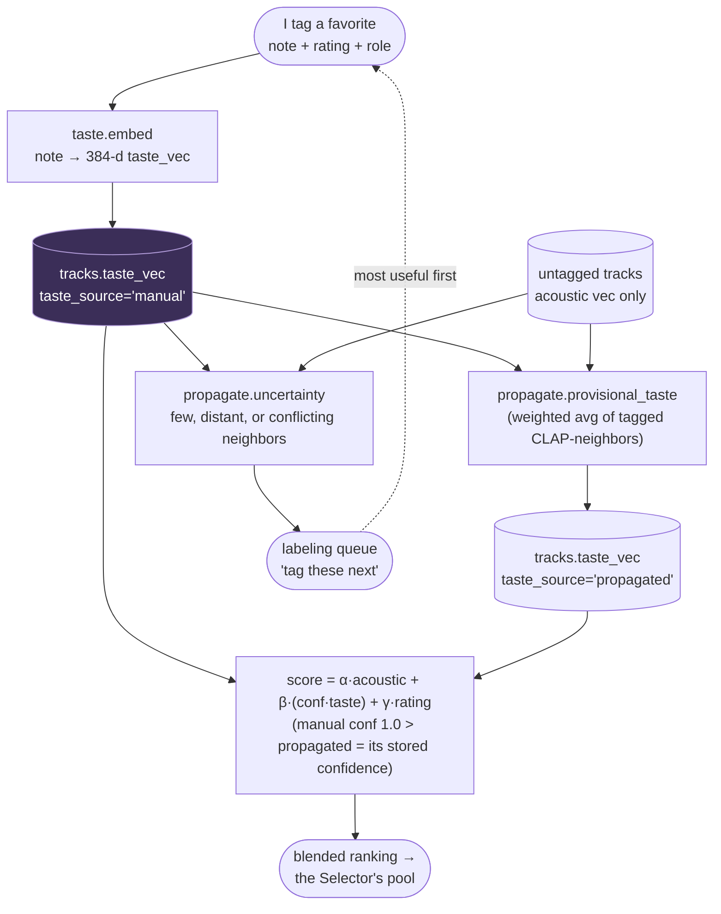

# The taste layer (what makes it *my* DJ)

> Decided in `adr/0003-personal-taste-layer.md`. This is the deep-dive on the
> personal signal — the thing that separates this from a worse Spotify.

## The problem it solves

CLAP tells you what a track *sounds like* to a model trained on the internet. It
does **not** know what *you* think of it. Two tracks you experience as totally
different vibes can sit next to each other in CLAP space because they're
acoustically similar. For a personal DJ agent, "what I think of this track" is
the whole point — and before this layer, the only personal signal in the system
was an `is_favorite` boolean from a folder name.

## Two vectors, one row

Every `tracks` row carries **two** vectors:

| Vector | Dim | Space | Means |
|---|---|---|---|
| `embedding` | 512 | CLAP audio | *general* — "what it sounds like" |
| `taste_vec` | 384 | sentence-transformer text | *me* — "what I said about it" |

Plus light structured taste columns: `taste_note` (the raw text), `rating`
(1–5), `role` (`warmup`/`peak`/`closer`/…), and `taste_source`
(`manual`/`propagated`).

They're **separate columns, not a fused vector**, so we can ask three different
questions against the same library:

- **acoustically similar** — rank by `embedding` alone (discovery, cold tracks)
- **matches my taste** — rank by `taste_vec` alone ("more like the ones I love")
- **blended** — `score = α·acoustic_sim + β·taste_sim + γ·rating`

No second "me" database — the separation is in the columns (see `ADR 0001`,
`ADR 0003`).

## Input: notes + light tags

For the tracks I care about, I capture in my own words:

- **note** — free text: *"hands-in-the-air drop, perfect sunset opener, the
  breakdown drags a little so mix out before it."*
- **rating** — 1–5.
- **role** — where it lives in a set: `warmup` / `peak` / `closer` / `tool` / …

The note is the rich part. It embeds into `taste_vec` and captures idiosyncratic
taste a fixed tag vocabulary never could. The rating/role are cheap hard filters
the Selector uses directly.

### The tagging UX — CLI first (`dj/taste/tag.py`)

Built as a plain CLI first; wrap it as a `vibe-tagging` skill later, once the
flow feels right.

```bash
python -m dj.taste.tag              # walk the active-learning queue, tagging
python -m dj.taste.tag <path>       # tag one specific track
python -m dj.taste.tag --queue [N]  # just list what to label next
python -m dj.taste.tag --propagate  # spread labels to untagged tracks
```

Per track it shows what we already know (BPM, key, acoustic neighbors for
context) and prompts for a note + rating (1–5) + role
(`warmup`/`build`/`peak`/`closer`/`tool`/`wildcard`). The note embeds into
`taste_vec`; rating/role become columns. The queue is ordered by
`propagate.uncertainty`, so the most useful labels come first — a few seconds per
track, not a data-entry chore.

### Capturing taste before you own the file (`dj/taste/pending.py`, ADR 0008)

`dj.taste.tag` needs the track already in the DB, which needs the file. But the
strongest taste signal happens *while listening* — usually on Spotify, no file in
hand. So capture is **decoupled from ingest**: a review left in the moment is
parked in `pending_taste` keyed by track identity, and the Curator applies it to
`tracks.taste_*` on the matching ingest — the note is "already ready", **no extra
input**.

Two capture flows, one sink (`agents.tools.save_review` → `pending.add`):

- **"review what's playing"** — the agent reads the Spotify MCP
  `get_currently_playing` for `artist`/`title`/`isrc`/`duration`, then saves it.
- **conversational** — "save a review for Bicep – Glue: dreamy 3am closer, 5".
  No Spotify dependency, so it survives any change to the Spotify MCP.

```bash
python -m dj.taste.review                 # type a review by hand (no Spotify)
python -m dj.taste.review --pending       # parked reviews = a want-list of music to get
python -m dj.taste.review --apply <id> <path>   # resolve an ambiguous match by hand
```

**Matching is confident-only** (the Curator auto-applies only sure matches): ISRC,
or a unique normalized `(artist, title)` + duration within ±5 s → applied silently
as a `manual` label; several name hits or a duration mismatch → left parked and
surfaced for a one-line resolve, so a review never lands on the wrong recording. A
parked review for a track I don't own yet is a **want-list** entry — music I've
already decided I love, go get the file.

## Tag ~150, not 2,000 — label propagation + active learning

I do **not** tag the whole library. I tag my favorites, and CLAP spreads those
sparse labels:



1. **Propagation.** An untagged track gets a *provisional* `taste_vec` from its
   tagged CLAP-neighbors (acoustic similarity as the bridge between the two
   spaces), with `taste_source = 'propagated'`.
2. **Active learning.** The agent surfaces the tracks worth labeling next — the
   ones where it's most *uncertain* (few tagged neighbors, conflicting neighbor
   ratings) or where **my taste diverges from acoustics** (acoustically central
   but I rate its neighbors all over the map). Labeling those buys the most signal.

So CLAP's real job in this project is **spreading my taste across the library**,
not being the taste itself.

## Blended scoring

The Selector retrieves with a tunable blend:

```
score(track) = α · cosine(embedding, q_acoustic)     # general vibe fit
             + β · cosine(taste_vec, q_taste)         # my taste
             + γ · (rating / 5)                       # explicit preference
```

- **α/β are per-query.** "Surprise me" leans α (discovery); "a set of my
  favorites" leans β + γ; most prompts are balanced.
- **Cold start.** Until ~50 tracks are tagged, β contributes little, so ranking ≈
  acoustic. Defaults lean acoustic early and shift taste-heavy as labels
  accumulate. `manual` taste outweighs `propagated` via a confidence weight on β.
- **Confidence is per-track, not flat.** A propagated row stores its own
  propagation confidence (the `taste_confidence` column — the weighted neighbor
  similarity), and `score()` uses it: `manual` = 1.0, `propagated` = that stored
  value (default 0.5 when absent). So a confidently-propagated track counts for
  more than a shaky one — no longer a single 0.5 for every propagated row.

## Where it lives  (built 2026-06-04; unit-tested without a DB)

```
src/dj/taste/
├── embed.py        # note → 384-d taste_vec (sentence-transformers, lazy import)
├── propagate.py    # provisional taste_vec + uncertainty/labeling_queue (pure + DB orchestration)
├── score.py        # blended score(α, β, γ) over candidates (pure, testable)
└── tag.py          # the vibe-tagging CLI (python -m dj.taste.tag)
```

`score.py` and the math in `propagate.py` are pure (numpy only) — unit-tested
with synthetic vectors, no DB (`tests/test_score.py`, `test_propagate.py`).
`embed.py` guards its heavy import like `vibe/clap.py` does. Blended retrieval
lives in `store.ranked()`: pgvector computes the cosine sims, `score.py` applies
the blend policy (weights, confidence, cold-start).

## How it feeds the rest

- **Selector** ranks candidates with `taste.score(...)` after the hard
  Camelot/BPM filters, blending taste + discovery to the requested mix.
- **Eval scorecard** adds **taste-match score** (mean `taste_vec` similarity of
  the chosen set to my labeled favorites) and **discovery ratio**.
- **Phase 6 (Memory)** learns taste from accept/skip/replay *on top of* these
  labels — the labeled `taste_vec` is the warm start, reactions refine it.
